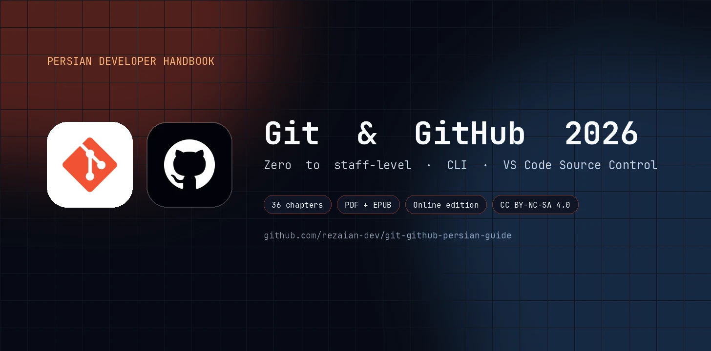
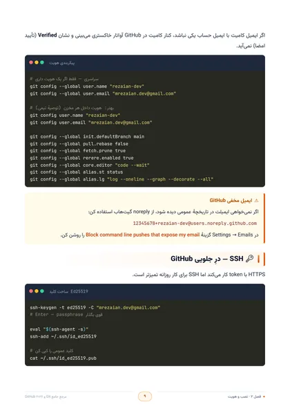
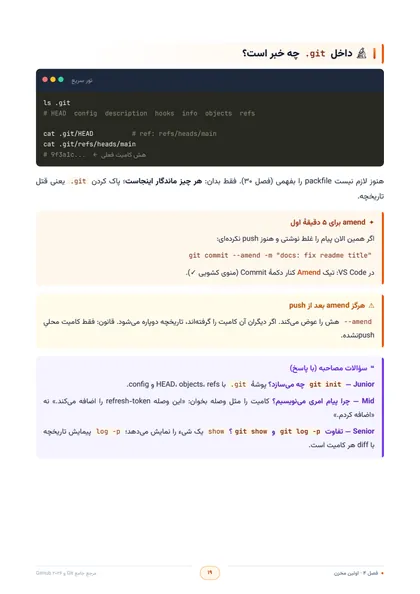
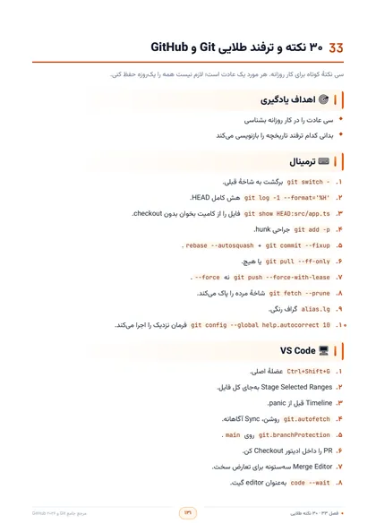

<a id="top"></a>

<p align="center">
  <a href="https://rezaian-dev.github.io/git-github-persian-guide/">
    
  </a>
</p>

<h1 align="center">📘 Git و GitHub ۲۰۲۶</h1>

<p align="center" dir="rtl">
  <strong>راهنمای فارسی از صفر تا سطح حرفه‌ای — یک کتاب، دو مسیر: ترمینال و VS Code</strong>
  <br>
  ✨ ۳۶ فصل · ۱۴۵ صفحه · کاملاً رایگان و متن‌باز
</p>

<p align="center">
  <a href="https://rezaian-dev.github.io/git-github-persian-guide/"></a>
  <a href="https://rezaian-dev.github.io/git-github-persian-guide/book/"></a>
  <a href="./docs/pdf/Git-GitHub-Persian-Guide.pdf"></a>
  <a href="./docs/pdf/Git-GitHub-Persian-Guide.epub"></a>
</p>

<p align="center">
  
  
  
  
</p>

<p align="center" dir="rtl">
  <a href="#-چرا-این-کتاب">📖 چرا این کتاب؟</a> ·
  <a href="#-این-کتاب-برای-چه-کسی-است">🎯 برای چه کسی؟</a> ·
  <a href="#-چه-چیزی-آن-را-متفاوت-می‌کند">✨ تفاوتش چیست؟</a> ·
  <a href="#-مسیر-مطالعه">🗺️ مسیر مطالعه</a> ·
  <a href="#-فهرست-فصل‌ها">📚 فصل‌ها</a> ·
  <a href="#-نگاهی-به-داخل">🖼️ داخل کتاب</a> ·
  <a href="#-نسخه‌های-آماده">📦 نسخه‌ها</a>
</p>

---

<div dir="rtl">

<a id="-چرا-این-کتاب"></a>

## 📖 چرا این کتاب؟

اکثر آموزش‌های Git یک مشکل مشترک دارند: یک فهرست بلند از فرمان‌ها که حفظش می‌کنی، امتحانش را می‌دهی و یک هفته بعد همه‌چیز را فراموش می‌کنی. 🤯

این کتاب راه دیگری می‌رود. اول **مدل ذهنی** را در سرت می‌سازد — سه درخت، DAG و اشاره‌گر شاخه — بعد هر فرمانی که یاد می‌گیری، دقیقاً می‌دانی **کدام لایه را تغییر می‌دهد و چرا**. نتیجه این است که دیگر فرمان را حفظ نمی‌کنی؛ **تصمیم می‌گیری** که چه اتفاقی بیفتد.

و چون دنیای واقعی فقط ترمینال نیست، هر مهارت را **دو بار** یاد می‌گیری: یک بار با فرمان در CLI و یک بار با کلیک‌های دقیق در پنل `Ctrl+Shift+G` در VS Code. 🖥️

<a id="-این-کتاب-برای-چه-کسی-است"></a>

## 🎯 این کتاب برای چه کسی است؟

- 🌱 **تازه‌کار هستی و می‌خواهی درست شروع کنی؟** از فصل اول قدم‌به‌قدم جلو می‌روی؛ بدون پیش‌فرض، تا اولین Pull Request واقعی.
- 🔁 **روزانه commit می‌زنی ولی حس می‌کنی «چشم‌بسته» کار می‌کنی؟** بخش‌های دوم و سوم شکاف‌های ذهنی‌ات را پر می‌کنند و کارت را از «تقلید» به «تسلط» می‌برند.
- 🚀 **در تیم کار می‌کنی یا مسئول کیفیت و CI/CD هستی؟** فصل‌های Rulesets، Actions، امضا و امنیت زنجیرهٔ تأمین برای تو نوشته شده‌اند.
- 🎓 **برای مصاحبه آماده می‌شوی؟** فصل آخر با پرسش‌های رایج و واژه‌نامه، آماده‌ات می‌کند.

<a id="-چه-چیزی-آن-را-متفاوت-می‌کند"></a>

## ✨ چه چیزی آن را متفاوت می‌کند؟

- 🧠 **مدل ذهنی، نه حفظ API** — سه درخت، Index و HEAD را می‌فهمی؛ بعد `switch` و `rebase` دیگر رمز نیستند.
- 💻 **دو مسیر موازی** — هر مهارت یک بار در ترمینال، یک بار در VS Code؛ با عکس محیط واقعی و توضیح اگر UI تو فرق داشت.
- 🛤️ **مسیر رسمی ۲۰۲۶** — `git switch` و `git restore` به‌جای `checkout` دوچهره؛ فرمان‌های آزمایش‌شده روی Git ۲.۴۷+.
- 🛡️ **از commit تا Production** — امضا، رازها، Rulesets، Dependabot و GitHub Actions.
- 🧪 **کارگاه و آمادگی شغلی** — چهار مینی‌پروژه، بیست اشتباه رایج و واژه‌نامهٔ مصاحبه.

<a id="-مسیر-مطالعه"></a>

## 🗺️ مسیر مطالعه — چهار گام

### 🌱 گام اول · بنیادها و مدل ذهنی <small>(فصل‌های ۱ تا ۱۰)</small>

نصب، سه درخت، اشیاء، شاخه، ادغام، Undo و Source Control از صفر.
**دستاورد:** دیگر نمی‌پرسی «این فرمان کدام لایه را عوض کرد؟»

### 🔁 گام دوم · کار روزانه و GitHub <small>(فصل‌های ۱۱ تا ۲۲)</small>

Graph تا PR، remote، fork، Code Review، `gh` و Conventional Commits.
**دستاورد:** همکاری واقعی روی GitHub بدون حدس زدن UI.

### 🚀 گام سوم · پیشرفته، امنیت و CI <small>(فصل‌های ۲۳ تا ۳۲)</small>

rebase، hooks، امضا، Rulesets، Actions و زنجیرهٔ تأمین.
**دستاورد:** سیاست تیم و کیفیت Production.

### 🏁 گام چهارم · کارگاه و آمادگی شغلی <small>(فصل‌های ۳۳ تا ۳۶)</small>

نکات، چهار مینی‌پروژه، اشتباهات رایج و مصاحبه.
**دستاورد:** تثبیت مهارت و آمادگی مصاحبه.

> 💡 تازه‌کارید؟ از گام اول شروع کنید. روزانه commit می‌زنید؟ مستقیم به گام سوم یا چهارم بروید.

<a id="-فهرست-فصل‌ها"></a>

## 📚 فهرست فصل‌ها

> 🔗 هر فصل مستقیم در **نسخهٔ آنلاین کتاب** باز می‌شود. متن کامل به‌صورت PDF، EPUB و HTML در دسترس است.

<details>
<summary><strong>🌱 گام اول — بنیادها و مدل ذهنی</strong> · فصل‌های ۱ تا ۱۰</summary>


1. [معرفی Git و نقشه راه ۲۰۲۶](https://rezaian-dev.github.io/git-github-persian-guide/book/#ch-01)
2. [نصب و هویت](https://rezaian-dev.github.io/git-github-persian-guide/book/#ch-02)
3. [سه درخت](https://rezaian-dev.github.io/git-github-persian-guide/book/#ch-03)
4. [اولین مخزن](https://rezaian-dev.github.io/git-github-persian-guide/book/#ch-04)
5. [اشیای Git](https://rezaian-dev.github.io/git-github-persian-guide/book/#ch-05)
6. [شاخه‌ها](https://rezaian-dev.github.io/git-github-persian-guide/book/#ch-06)
7. [ادغام و تعارض](https://rezaian-dev.github.io/git-github-persian-guide/book/#ch-07)
8. [Undo](https://rezaian-dev.github.io/git-github-persian-guide/book/#ch-08)
9. [gitignore، attributes، LFS](https://rezaian-dev.github.io/git-github-persian-guide/book/#ch-09)
10. [Source Control از صفر — Ctrl+Shift+G](https://rezaian-dev.github.io/git-github-persian-guide/book/#ch-10)

</details>

<details>
<summary><strong>🔁 گام دوم — کار روزانه، VS Code و GitHub</strong> · فصل‌های ۱۱ تا ۲۲</summary>

11. [Source Control فوق‌پیشرفته](https://rezaian-dev.github.io/git-github-persian-guide/book/#ch-11)
12. [diff، log، blame، bisect](https://rezaian-dev.github.io/git-github-persian-guide/book/#ch-12)
13. [stash، worktree، sparse-checkout](https://rezaian-dev.github.io/git-github-persian-guide/book/#ch-13)
14. [Remote](https://rezaian-dev.github.io/git-github-persian-guide/book/#ch-14)
15. [ریپوی GitHub](https://rezaian-dev.github.io/git-github-persian-guide/book/#ch-15)
16. [Clone، Fork و Upstream](https://rezaian-dev.github.io/git-github-persian-guide/book/#ch-16)
17. [Pull Request](https://rezaian-dev.github.io/git-github-persian-guide/book/#ch-17)
18. [Code Review](https://rezaian-dev.github.io/git-github-persian-guide/book/#ch-18)
19. [GitHub CLI](https://rezaian-dev.github.io/git-github-persian-guide/book/#ch-19)
20. [Issues و Projects](https://rezaian-dev.github.io/git-github-persian-guide/book/#ch-20)
21. [استراتژی شاخه](https://rezaian-dev.github.io/git-github-persian-guide/book/#ch-21)
22. [Conventional Commits](https://rezaian-dev.github.io/git-github-persian-guide/book/#ch-22)

</details>

<details>
<summary><strong>🚀 گام سوم — پیشرفته، امنیت و CI</strong> · فصل‌های ۲۳ تا ۳۲</summary>

23. [Rebase تعاملی](https://rezaian-dev.github.io/git-github-persian-guide/book/#ch-23)
24. [Cherry-pick و rerere](https://rezaian-dev.github.io/git-github-persian-guide/book/#ch-24)
25. [Hooks](https://rezaian-dev.github.io/git-github-persian-guide/book/#ch-25)
26. [امضا و راز](https://rezaian-dev.github.io/git-github-persian-guide/book/#ch-26)
27. [Rulesets](https://rezaian-dev.github.io/git-github-persian-guide/book/#ch-27)
28. [GitHub Actions](https://rezaian-dev.github.io/git-github-persian-guide/book/#ch-28)
29. [امنیت زنجیرهٔ تأمین](https://rezaian-dev.github.io/git-github-persian-guide/book/#ch-29)
30. [داخلی Git](https://rezaian-dev.github.io/git-github-persian-guide/book/#ch-30)
31. [مخازن بزرگ](https://rezaian-dev.github.io/git-github-persian-guide/book/#ch-31)
32. [Copilot و Coding Agent](https://rezaian-dev.github.io/git-github-persian-guide/book/#ch-32)

</details>

<details>
<summary><strong>🏁 گام چهارم — کارگاه و آمادگی شغلی</strong> · فصل‌های ۳۳ تا ۳۶</summary>

33. [۳۰ نکته طلایی](https://rezaian-dev.github.io/git-github-persian-guide/book/#ch-33)
34. [کارگاه چهار مینی‌پروژه](https://rezaian-dev.github.io/git-github-persian-guide/book/#ch-34)
35. [۲۰ اشتباه رایج](https://rezaian-dev.github.io/git-github-persian-guide/book/#ch-35)
36. [مصاحبه، واژه‌نامه و نقشه راه](https://rezaian-dev.github.io/git-github-persian-guide/book/#ch-36)

</details>

<a id="-نگاهی-به-داخل"></a>

## 🖼️ نگاهی به داخل

<p align="center">
  <a href="./docs/assets/page-toc.jpg"></a>
  <a href="./docs/assets/page-chapter.jpg"></a>
  <a href="./docs/assets/page-code.jpg"></a>
  <a href="./docs/assets/page-workshop.jpg"></a>
</p>

<a id="-نسخه‌های-آماده"></a>

## 📦 همین حالا بخوانید

همهٔ نسخه‌ها رایگان‌اند — هر طور راحت‌ترید شروع کنید:

| نسخه | مناسب برای | لینک |
|---|---|---|
| 🌐 **نسخهٔ آنلاین** | مطالعهٔ سریع در مرورگر | [rezaian-dev.github.io/git-github-persian-guide](https://rezaian-dev.github.io/git-github-persian-guide/) |
| 📖 **نسخهٔ HTML کتاب** | خواندن کامل هر ۳۶ فصل | [کتاب HTML](https://rezaian-dev.github.io/git-github-persian-guide/book/) |
| 📄 **PDF** | چاپ و مطالعهٔ آفلاین · ۱۴۵ صفحهٔ A4 رنگی | [دانلود PDF](./docs/pdf/Git-GitHub-Persian-Guide.pdf) |
| 📱 **EPUB** | کتاب‌خوان و موبایل · راست‌به‌چپ | [دانلود EPUB](./docs/pdf/Git-GitHub-Persian-Guide.epub) |

<a id="-مجموعه-راهنماها"></a>

## 🧭 بخشی از یک مجموعهٔ بزرگ‌تر

این کتاب یکی از چهار مرجع فارسی یک مسیر هماهنگ است: از همکاری با Git، به زبان JavaScript، رابط React و در نهایت Production با Next.js.

- 🔀 **Git و GitHub ۲۰۲۶** — نسخه‌بندی و همکاری · **همین کتاب** ⬅️
- ⚡ **[JavaScript ES2025](https://github.com/rezaian-dev/javascript-persian-guide)** — زبان و مدل ذهنی
- ⚛️ **[React 19.2](https://github.com/rezaian-dev/react-19-persian-guide)** — رابط کاربری و معماری کامپوننت
- ▲ **[Next.js 16](https://github.com/rezaian-dev/nextjs-16-persian-guide)** — فریم‌ورک و استقرار

<a id="-درباره-نویسنده"></a>

## 👨‍💻 دربارهٔ نویسنده

**محمدرضا رضائیان** — توسعه‌دهنده و نویسندهٔ مجموعه راهنماهای فارسی، با تمرکز بر مدل ذهنی و انتقال تجربهٔ مهندسی به زبان روشن.

📮 گزارش خطا و پیشنهاد: [Issues](https://github.com/rezaian-dev/git-github-persian-guide/issues) · [@rezaian-dev](https://github.com/rezaian-dev)

<a id="-مجوز"></a>

## 📜 مجوز

این اثر با مجوز [Creative Commons BY-NC-SA 4.0](./LICENSE) منتشر شده است؛ استفادهٔ غیرتجاری با ذکر منبع آزاد است و هر اقتباس باید با همین مجوز منتشر شود.

</div>

<a id="-استقرار-روی-vercel"></a>

## 🚀 استقرار روی Vercel

اپلیکیشن Next.js در ریشهٔ مخزن قرار دارد و Vercel آن را به‌صورت خودکار تشخیص می‌دهد — بدون هیچ تنظیم اضافه‌ای. کافی است دکمهٔ زیر را بزنید:

<p align="center">
  <a href="https://vercel.com/new/clone?repository-url=https%3A%2F%2Fgithub.com%2Frezaian-dev%2Fgit-github-persian-guide">
    
  </a>
</p>

یا به‌صورت دستی:

1. در Vercel → **Add New… → Project** و مخزن را **Import** کنید.
2. **Framework Preset** خودکار روی `Next.js` تشخیص داده می‌شود.
3. **Deploy** را بزنید.


<details>
<summary>🛠️ برای توسعه‌دهندگان — ساخت از سورس</summary>

<div dir="rtl">

متن کتاب به‌صورت خصوصی نگهداری می‌شود و در این مخزن فقط **خروجی‌های منتشرشده** (PDF، EPUB و نسخهٔ آنلاین) قرار دارند. اسکریپت‌های ساخت در `book/` باقی مانده‌اند و در صورت وجود سورس فصل‌ها این‌طور اجرا می‌شوند:

```bash
git clone https://github.com/rezaian-dev/git-github-persian-guide.git
cd git-github-persian-guide

python -m venv .venv
source .venv/bin/activate       # macOS / Linux
# .venv\Scripts\Activate.ps1   # Windows PowerShell

python -m pip install -r book/requirements.txt
python book/build.py --html      # HTML داخلی
python book/build.py             # PDF
python book/build_epub.py        # EPUB
python book/build_site.py        # دارایی‌های GitHub Pages
```

> نیازمند Python 3.10+ و وابستگی‌های سیستمی [WeasyPrint](https://doc.courtbouillon.org/weasyprint/stable/first_steps.html#installation) برای PDF.

**اجرای اپلیکیشن Next.js** (ریشهٔ مخزن، نیازمند Node.js ۲۰.۹+):

```bash
npm install
npm run dev          # http://localhost:3000
npm run build        # بیلد پروداکشن (Vercel)
npm run build:pages  # خروجی استاتیک در docs/ — همان چیزی که GitHub Pages منتشر می‌کند
```

> 📌 GitHub Pages مستقیماً پوشهٔ `docs/` روی شاخهٔ `master` را سرو می‌کند؛ بنابراین
> بعد از هر بار `npm run build:pages` کافی است تغییرات `docs/` را کامیت کنید.

مشارکت شما خوش‌آمد است 🙌 — Pull Request بهتر است کوچک، متمرکز و با دلیل تغییر باشد.

</div>
</details>

---

<p align="center" dir="rtl">
  اگر این کتاب برایتان مفید بود، با ثبت یک ⭐ از ادامهٔ مسیر حمایت کنید. 💙
  <br>
  <a href="#top">بازگشت به بالا ⬆️</a>
</p>
