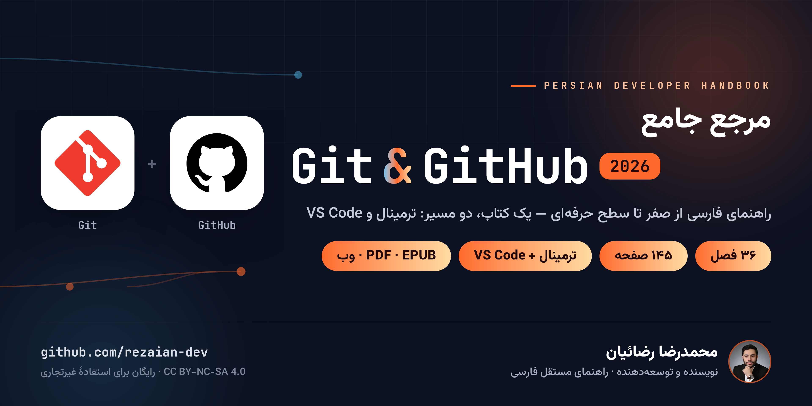
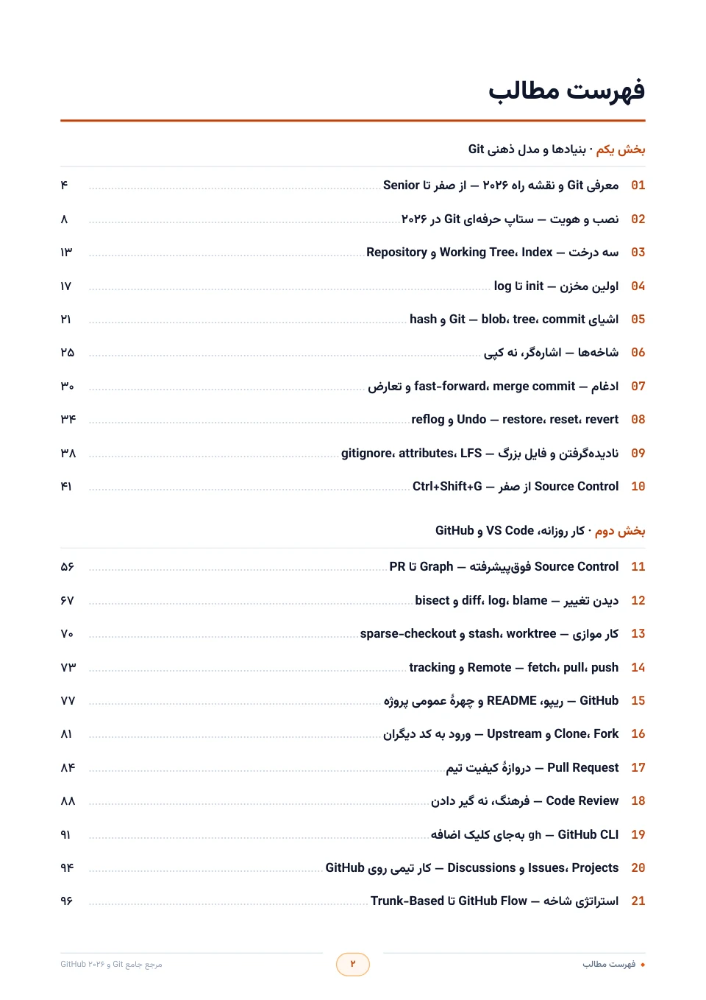
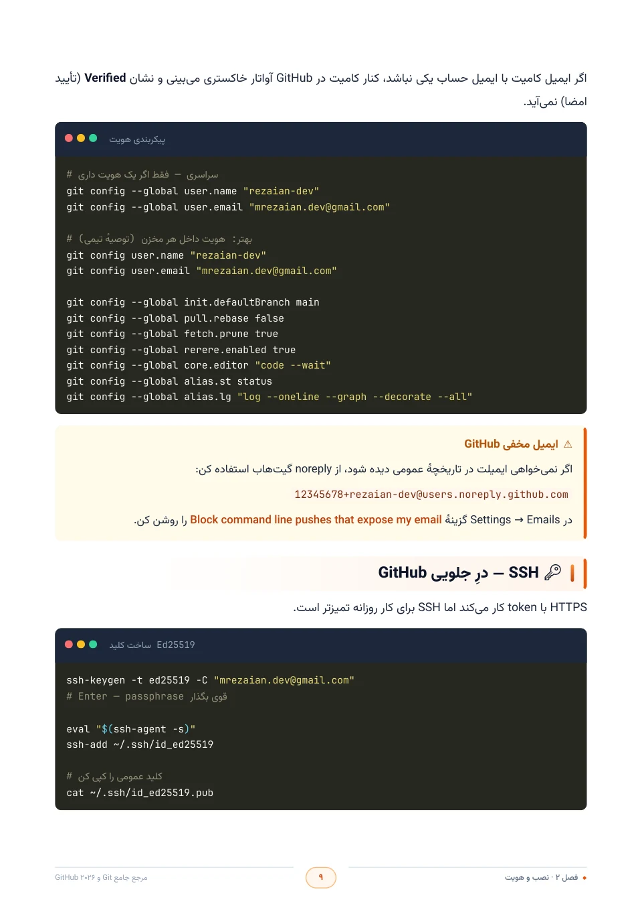
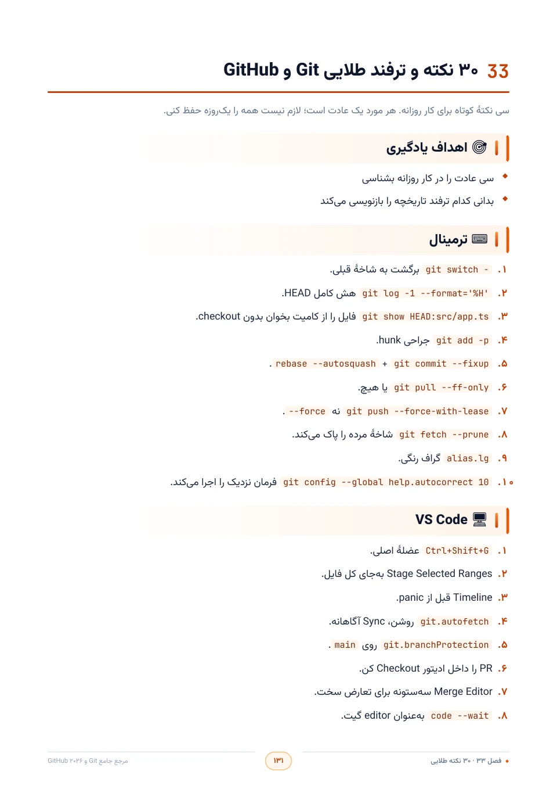

  

<h1 align="center">📘 Git و GitHub ۲۰۲۶</h1>

  <strong>مرجع جامع فارسی از صفر تا سطح حرفه‌ای — یک کتاب، دو مسیر: ترمینال و VS Code</strong>
   
  ✨ ۳۶ فصل · ۱۴۵ صفحه · رایگان برای مطالعه و استفادهٔ غیرتجاری

  
  
  
  

  
  
  
  

  <a href="#-چرا-این-کتاب">📖 چرا این کتاب؟</a> ·
  <a href="#-این-کتاب-برای-چه-کسی-است">🎯 برای چه کسی؟</a> ·
  <a href="#-پیشنیازها">🧰 پیش‌نیازها</a> ·
  <a href="#-چه-چیزی-آن-را-متفاوت-میکند">✨ تفاوتش چیست؟</a> ·
  <a href="#-مسیر-مطالعه">🗺️ مسیر مطالعه</a> ·
  <a href="#-فهرست-فصلها">📚 فصل‌ها</a> ·
  <a href="#-نگاهی-به-داخل">🖼️ داخل کتاب</a> ·
  <a href="#-نسخهها">📦 نسخه‌ها</a>

---

## 📖 چرا این کتاب؟

اکثر آموزش‌های Git یک مشکل مشترک دارند: یک فهرست بلند از فرمان‌ها که حفظش می‌کنی و یک هفته بعد همه‌چیز را فراموش می‌کنی. 🤯

این کتاب راه دیگری می‌رود. اول **مدل ذهنی** را در سرت می‌سازد — سه درخت، DAG و اشاره‌گر شاخه — بعد هر فرمانی که یاد می‌گیری، دقیقاً می‌دانی **کدام لایه را تغییر می‌دهد و چرا**. نتیجه این است که دیگر فرمان را حفظ نمی‌کنی؛ **تصمیم می‌گیری** که چه اتفاقی بیفتد.

Git ابزار کنترل نسخه روی رایانهٔ توست و GitHub بستری برای میزبانی و همکاری؛ این کتاب هر دو را سر جای خودشان یاد می‌دهد و چون دنیای واقعی فقط ترمینال نیست، هر مهارت را **دو بار** یاد می‌گیری: یک بار با فرمان در CLI و یک بار با کلیک‌های دقیق در پنل `Ctrl+Shift+G` در VS Code. 🖥️

## 🎯 این کتاب برای چه کسی است؟

- 🌱 **تازه‌کار هستی و می‌خواهی درست شروع کنی؟** از فصل اول قدم‌به‌قدم جلو می‌روی؛ بدون پیش‌فرض، تا اولین Pull Request واقعی.
- 🔁 **روزانه commit می‌زنی ولی حس می‌کنی «چشم‌بسته» کار می‌کنی؟** بخش‌های دوم و سوم شکاف‌های ذهنی‌ات را پر می‌کنند و کارت را از «تقلید» به «تسلط» می‌برند.
- 🚀 **در تیم کار می‌کنی یا مسئول کیفیت و CI/CD هستی؟** فصل‌های Rulesets، Actions، امضا و امنیت زنجیرهٔ تأمین برای تو نوشته شده‌اند.
- 🎓 **برای مصاحبه آماده می‌شوی؟** سؤال‌های مصاحبه در متن فصل‌ها و واژه‌نامهٔ فصل آخر، آماده‌ات می‌کند.

## 🧰 پیش‌نیازها

- 💻 یک رایانه با Windows، macOS یا Linux — نصب و پیکربندی Git از صفر در فصل ۲ آمده است.
- 🆓 برای فصل‌های GitHub یک حساب رایگان GitHub لازم است.
- 📝 برای مسیر دوم، VS Code نصب‌شده (کار با پنل Source Control از صفر در فصل ۱۰ آموزش داده می‌شود).
- ✅ هیچ آشنایی قبلی با Git لازم نیست.

## ✨ چه چیزی آن را متفاوت می‌کند؟

- 🧠 **مدل ذهنی، نه حفظ API** — سه درخت، Index و HEAD را می‌فهمی؛ بعد `switch` و `rebase` دیگر رمز نیستند.
- 💻 **دو مسیر موازی** — هر مهارت یک بار در ترمینال، یک بار در VS Code؛ با عکس محیط واقعی.
- 🛤️ **مسیر رسمی ۲۰۲۶** — `git switch` و `git restore` به‌جای `checkout` دوچهره.
- 🛡️ **از commit تا Production** — امضا، رازها، Rulesets، Dependabot و GitHub Actions.
- 🧪 **کارگاه و آمادگی شغلی** — چهار مینی‌پروژه، بیست اشتباه رایج، سی نکتهٔ طلایی و واژه‌نامهٔ مصاحبه.

## 🗺️ مسیر مطالعه — چهار گام

### 🌱 گام اول · بنیادها و مدل ذهنی <small>(فصل‌های ۱ تا ۱۰)</small>

نصب، سه درخت، اشیاء، شاخه، ادغام، Undo و Source Control از صفر.
**دستاورد:** دیگر نمی‌پرسی «این فرمان کدام لایه را عوض کرد؟»

### 🔁 گام دوم · کار روزانه و GitHub <small>(فصل‌های ۱۱ تا ۲۲)</small>

Graph تا PR، remote، fork، Code Review، ‏`gh`‏ و Conventional Commits.
**دستاورد:** همکاری واقعی روی GitHub بدون حدس زدن UI.

### 🚀 گام سوم · پیشرفته، امنیت و CI <small>(فصل‌های ۲۳ تا ۳۲)</small>

rebase، hooks، امضا، Rulesets، Actions و زنجیرهٔ تأمین.
**دستاورد:** سیاست تیم و کیفیت Production.

### 🏁 گام چهارم · کارگاه و آمادگی شغلی <small>(فصل‌های ۳۳ تا ۳۶)</small>

نکات، چهار مینی‌پروژه، اشتباهات رایج و مصاحبه.
**دستاورد:** تثبیت مهارت و آمادگی مصاحبه.

> 💡 تازه‌کارید؟ از گام اول شروع کنید. روزانه commit می‌زنید؟ مستقیم به گام سوم یا چهارم بروید.

## 📚 فهرست فصل‌ها

> 🔗 هر فصل مستقیم در **ریدر آنلاین** باز می‌شود؛ متن کامل هر ۳۶ فصل قابل انتخاب و جست‌وجوست.

<strong>🌱 گام اول — بنیادها و مدل ذهنی</strong> · فصل‌های ۱ تا ۱۰

1. [معرفی Git و نقشه راه ۲۰۲۶](https://rezaian-dev.github.io/git-github-persian-guide/book/1)
2. [نصب و هویت](https://rezaian-dev.github.io/git-github-persian-guide/book/2)
3. [سه درخت](https://rezaian-dev.github.io/git-github-persian-guide/book/3)
4. [اولین مخزن](https://rezaian-dev.github.io/git-github-persian-guide/book/4)
5. [اشیای Git](https://rezaian-dev.github.io/git-github-persian-guide/book/5)
6. [شاخه‌ها](https://rezaian-dev.github.io/git-github-persian-guide/book/6)
7. [ادغام و تعارض](https://rezaian-dev.github.io/git-github-persian-guide/book/7)
8. [Undo](https://rezaian-dev.github.io/git-github-persian-guide/book/8)
9. [gitignore، attributes، LFS](https://rezaian-dev.github.io/git-github-persian-guide/book/9)
10. [Source Control از صفر — Ctrl+Shift+G](https://rezaian-dev.github.io/git-github-persian-guide/book/10)

<strong>🔁 گام دوم — کار روزانه، VS Code و GitHub</strong> · فصل‌های ۱۱ تا ۲۲

11. [Source Control فوق‌پیشرفته](https://rezaian-dev.github.io/git-github-persian-guide/book/11)
12. [diff، log، blame، bisect](https://rezaian-dev.github.io/git-github-persian-guide/book/12)
13. [stash، worktree، sparse-checkout](https://rezaian-dev.github.io/git-github-persian-guide/book/13)
14. [Remote](https://rezaian-dev.github.io/git-github-persian-guide/book/14)
15. [ریپوی GitHub](https://rezaian-dev.github.io/git-github-persian-guide/book/15)
16. [Clone، Fork و Upstream](https://rezaian-dev.github.io/git-github-persian-guide/book/16)
17. [Pull Request](https://rezaian-dev.github.io/git-github-persian-guide/book/17)
18. [Code Review](https://rezaian-dev.github.io/git-github-persian-guide/book/18)
19. [GitHub CLI](https://rezaian-dev.github.io/git-github-persian-guide/book/19)
20. [Issues و Projects](https://rezaian-dev.github.io/git-github-persian-guide/book/20)
21. [استراتژی شاخه](https://rezaian-dev.github.io/git-github-persian-guide/book/21)
22. [Conventional Commits](https://rezaian-dev.github.io/git-github-persian-guide/book/22)

<strong>🚀 گام سوم — پیشرفته، امنیت و CI</strong> · فصل‌های ۲۳ تا ۳۲

23. [Rebase تعاملی](https://rezaian-dev.github.io/git-github-persian-guide/book/23)
24. [Cherry-pick و rerere](https://rezaian-dev.github.io/git-github-persian-guide/book/24)
25. [Hooks](https://rezaian-dev.github.io/git-github-persian-guide/book/25)
26. [امضا و راز](https://rezaian-dev.github.io/git-github-persian-guide/book/26)
27. [Rulesets](https://rezaian-dev.github.io/git-github-persian-guide/book/27)
28. [GitHub Actions](https://rezaian-dev.github.io/git-github-persian-guide/book/28)
29. [امنیت زنجیرهٔ تأمین](https://rezaian-dev.github.io/git-github-persian-guide/book/29)
30. [داخلی Git](https://rezaian-dev.github.io/git-github-persian-guide/book/30)
31. [مخازن بزرگ](https://rezaian-dev.github.io/git-github-persian-guide/book/31)
32. [Copilot و Coding Agent](https://rezaian-dev.github.io/git-github-persian-guide/book/32)

<strong>🏁 گام چهارم — کارگاه و آمادگی شغلی</strong> · فصل‌های ۳۳ تا ۳۶

33. [۳۰ نکته طلایی](https://rezaian-dev.github.io/git-github-persian-guide/book/33)
34. [کارگاه چهار مینی‌پروژه](https://rezaian-dev.github.io/git-github-persian-guide/book/34)
35. [۲۰ اشتباه رایج](https://rezaian-dev.github.io/git-github-persian-guide/book/35)
36. [مصاحبه، واژه‌نامه و نقشه راه](https://rezaian-dev.github.io/git-github-persian-guide/book/36)

## 🖼️ نگاهی به داخل

  
  
  
  

> 🔍 روی هر تصویر کلیک کنید تا صفحهٔ کامل باکیفیت بالا باز شود.

## 📦 نسخه‌ها — همین حالا بخوانید

همهٔ نسخه‌ها رایگان‌اند — هر طور راحت‌ترید شروع کنید:

| نسخه | مناسب برای | لینک |
|---|---|---|
| 🌐 **وب‌سایت کتاب** | معرفی، مسیر مطالعه و فهرست فصل‌ها | [rezaian-dev.github.io/git-github-persian-guide](https://rezaian-dev.github.io/git-github-persian-guide/) |
| 📖 **ریدر آنلاین** | خواندن کامل هر ۳۶ فصل؛ متن واقعی، قابل انتخاب و جست‌وجو | [مطالعهٔ آنلاین](https://rezaian-dev.github.io/git-github-persian-guide/book) |
| 📄 **PDF** | چاپ و مطالعهٔ آفلاین · ۱۴۵ صفحهٔ A4 رنگی، قابل جست‌وجو | [دانلود PDF](./public/pdf/Git-GitHub-Persian-Guide.pdf) |
| 📱 **EPUB** | کتاب‌خوان و موبایل · متن واقعی، بازچینش‌پذیر و راست‌به‌چپ | [دانلود EPUB](./public/pdf/Git-GitHub-Persian-Guide.epub) |

## 🧭 بخشی از یک مجموعهٔ بزرگ‌تر

این کتاب یکی از چهار مرجع فارسی یک مسیر هماهنگ است: از همکاری با Git، به زبان JavaScript، رابط React و در نهایت Production با Next.js.

- 🔀 **Git و GitHub ۲۰۲۶** — نسخه‌بندی و همکاری · **همین کتاب** ⬅️
- ⚡ **[JavaScript ES2025](https://github.com/rezaian-dev/javascript-persian-guide)** — زبان و مدل ذهنی
- ⚛️ **[React 19.2](https://github.com/rezaian-dev/react-19-persian-guide)** — رابط کاربری و معماری کامپوننت
- ▲ **[Next.js 16](https://github.com/rezaian-dev/nextjs-16-persian-guide)** — فریم‌ورک و استقرار

## 👨‍💻 دربارهٔ نویسنده

**محمدرضا رضائیان** — توسعه‌دهنده و نویسندهٔ مجموعه راهنماهای فارسی، با تمرکز بر مدل ذهنی و انتقال تجربهٔ مهندسی به زبان روشن.

## 💬 بازخورد

📮 گزارش خطا و پیشنهاد: [Issues](https://github.com/rezaian-dev/git-github-persian-guide/issues) · [@rezaian-dev](https://github.com/rezaian-dev)

## 📜 مجوز

این اثر با مجوز [Creative Commons BY-NC-SA 4.0](./LICENSE) منتشر شده است: استفادهٔ غیرتجاری با ذکر منبع آزاد است و هر اقتباس باید با همین مجوز منتشر شود. «رایگان بودن» به معنی اجازهٔ استفادهٔ تجاری نیست.

## 🙏 سپاس و نشان‌ها

- 🔤 قلم‌های [وزیرمتن](https://github.com/rastikerdar/vazirmatn) و [JetBrains Mono](https://github.com/JetBrains/JetBrainsMono) با مجوز SIL Open Font License 1.1 (متن مجوز در [`src/fonts/OFL.txt`](./src/fonts/OFL.txt)).
- 🔀 نشان Git از [git-scm.com/downloads/logos](https://git-scm.com/downloads/logos) — اثر Jason Long با مجوز CC BY 3.0.
- 🐙 نشان GitHub از [Brand Toolkit رسمی GitHub](https://brand.github.com/) — علامت تجاری GitHub, Inc.؛ این کتاب مستقل است و تأیید رسمی GitHub را القا نمی‌کند.

---

  اگر این کتاب برایتان مفید بود، با ثبت یک ⭐ از ادامهٔ مسیر حمایت کنید. 💙
   
  <a href="#top">بازگشت به بالا ⬆️</a>

