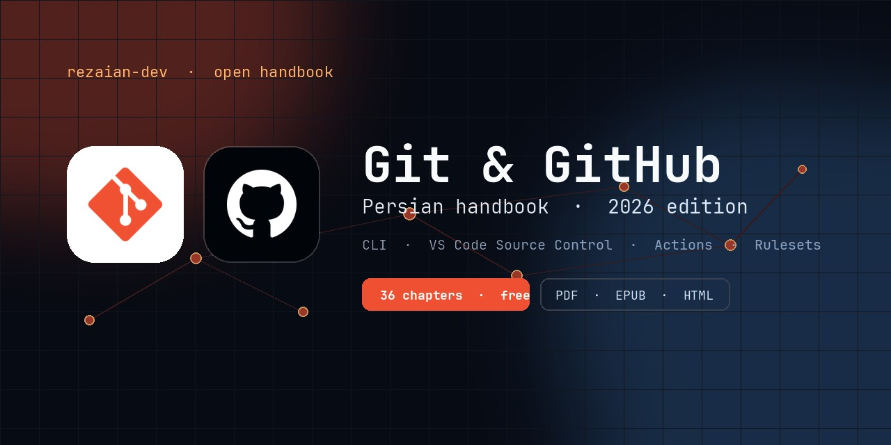

# 📚 مرجع جامع Git و GitHub — ترمینال و VS Code

**نویسنده: محمدرضا رضائیان**

**۱۴۵ صفحهٔ PDF · ۳۶ فصل · زبان فارسی**

[**🌐 مطالعهٔ آنلاین**](https://rezaian-dev.github.io/git-github-persian-guide/book/) · [**📕 دریافت PDF**](https://rezaian-dev.github.io/git-github-persian-guide/pdf/Git-GitHub-Persian-Guide.pdf) · [**✨ معرفی کتاب**](https://rezaian-dev.github.io/git-github-persian-guide/)

## 📖 بخوانید یا دانلود کنید

این راهنما برای یادگیری عمیق **Git و GitHub** نوشته شده است؛ همراه با توضیح مفاهیم، مثال، تمرین و پرسش‌های تحلیلی. نسخهٔ آنلاین را بدون نصب باز کنید یا PDF کامل را برای مطالعهٔ آفلاین و چاپ دریافت کنید.

| نسخه | دسترسی |
| --- | --- |
| 🌐 کتاب آنلاین | [شروع مطالعه](https://rezaian-dev.github.io/git-github-persian-guide/book/) |
| 📕 PDF کامل | [دانلود مستقیم](https://rezaian-dev.github.io/git-github-persian-guide/pdf/Git-GitHub-Persian-Guide.pdf) · [فایل مخزن](docs/pdf/Git-GitHub-Persian-Guide.pdf) |

## 🧹 ساختار این مخزن

این مخزن **فقط برای انتشار نهایی کتاب** است: PDF، صفحات آنلاین، تصویرها، فونت‌ها و فایل‌های مرورگری ضروری. سورس توسعه، ابزار ساخت، تست‌ها، تنظیمات CI و فایل‌های نصب وابستگی در شاخهٔ فعلی نگه‌داری نمی‌شوند.

فایل‌های مرورگری و تصویر صفحات، بخشی از خود خوانشگر هستند؛ حذف آن‌ها نمایش کتاب یا تعامل‌های سایت را خراب می‌کند. انتشار مستقیم از پوشهٔ `docs/` انجام می‌شود.

برای دسترسی به نمونه‌ها و منابع توسعهٔ نسخهٔ قبلی، [تاریخچهٔ پیش از پاک‌سازی](https://github.com/rezaian-dev/git-github-persian-guide/tree/11193969a7362ccc8580c65a43b07c97c2797a6d) در دسترس است. ارجاع‌های کتاب به فایل‌های آموزشی، به همان نسخهٔ تاریخی مربوط‌اند.

## 👤 نویسنده و حقوق اثر

**محمدرضا رضائیان — Front-End Engineer**

[پورتفولیو](https://rezaian-dev.vercel.app/fa) · [GitHub](https://github.com/rezaian-dev) · [گزارش اصلاح](https://github.com/rezaian-dev/git-github-persian-guide/issues)

مجوز کتاب: [CC BY-NC-SA 4.0](LICENSE). استفاده، بازنشر و اقتباس تابع شرایط همین مجوز است.

مجوز مستقل فونت‌ها و کتابخانه‌های مرورگری معتبر می‌ماند. برای پیشنهاد اصلاح، فصل و نسخهٔ نرم‌افزار را مشخص کنید و اعتبارنامه یا دادهٔ خصوصی نفرستید.

